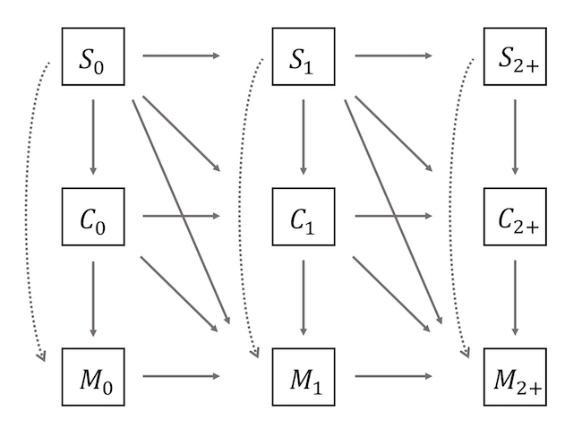

#### Data
To achieve our aim, retrospective union and fertility histories were used from the Harmonized Histories dataset. The Harmonized Histories dataset is a standardized multi-country dataset containing the same variables for all countries. Data for most countries are based on the Generations and Gender Survey (GGS). The detailed year-month histories of cohabitation, marriage, and childbirth in the Harmonized Histories allow us to construct a precise family-life course by age. We use data from 19 countries, Belarus, Belgium, Bulgaria, Czechia, Estonia, France, Germany, Hungary, Italy, Lithuania, the Netherlands, Norway, Poland, Romania, Russia, Spain, Sweden, the UK, and the US.

#### Methods
Multistate life tables are used to estimate the cohort survival function by union and parity status. Multistate life tables allow people to transition between states. Our states of interest are a combination of union formation (single, cohabitation, and ever-married) and parity status (0, 1, 2+): ($S_0$) single parity 0, ($S_1$) single parity 1, ($S_{2+}$) single parity 2+, ($C_0$) cohabitation parity 0, ($C_1$) cohabitation parity 1, ($C_{2+}$) cohabitation parity 2+, ($M_0$) ever-married parity 0, ($M_1$) ever-married parity 1, and ($M_{2+}$) ever-married parity 2+. Figure S1 shows the relationship of these nine states and the possible transitions between them shown by arrows. The transition rate from the state $i$ to $j$ at age $x$ of women born in year $t$, denoted as $m_{ij}(x,t)$ is calculated as
\[
m_{ij}(x,t) = \frac{d_{ij}(x,t)}{L_{i}(x,t)},
\]

where $d_{ij}(x,t)$ is the number of women born in year $t$ transitioning from state $i$ to $j$ at age $x$. $L_{i}(x,t)$ corresponds to the person-years for women born in year $t$, present in state $i$ and at age $x$.

&nbsp;&nbsp;&nbsp;&nbsp;&nbsp;As Figure S1 shows, some states have a hierarchical relationship, which means the transitions between states can only happen in one way. For example, people in an ever married state cannot go back to a single state and the transition from higher parity order to lower parity state is not possible. The transition matrix $\underline{m}(x,t)$ contains all the possible movements in Figure 1 at age $x$ for women born in year $t$ and its elements are the age- and cohort-specific transition rates, $m_{ij}(x,t)$. The notation of underlining a variable represents a matrix.

&nbsp;&nbsp;&nbsp;&nbsp;&nbsp;The transition matrix was used to calculate the number of persons in the cohort life table who are in each state $i$ at exact age $x$ (Schoen 1988). Thus, we have 
\[
\underline{l^c}(x,t)' = \underline{l^c}(x-1,t)'[I - \frac{1}{2}\underline{m}(x-1,t)][I + \frac{1}{2}\underline{m}(x-1,t)]^{-1},
\]

where $\underline{l^c}(x,t)$ is the survivorship vector at age $x$ for the life table that follows the transition rates of the cohort born in year $t$, its elements are the union and parity specific number of persons, $\underline{l^c}(x,t)' = (l^c_{S_0}, l^c_{C_0}, l^c_{M_0}, l^c_{S_1}, l^c_{C_1}, l^c_{M_1}, l^c_{S_{2+}}, l^c_{C_{2+}}, l^c_{M_{2+}})$, and $I$ is the $9\times9$ identity matrix. For all cohorts, we assume that all women start in the state of single and parity 0 at exact age 15, thus, the radix of $\underline{l^c}(x,t)$ is $\underline{l^c}(15,t)' = (1, 0, 0, 0, 0, 0, 0, 0, 0)$.

&nbsp;&nbsp;&nbsp;&nbsp;&nbsp;Changing the starting age and the radix assumption produces a conditional life table. The survivorship vector from the conditional life table, $\underline{l^c_{a,k}}(x,t)$ is interpreted as the proportion of people born in year $t$ being in state $i$ at age $x$ conditional on being in state $k$ at age $a$, with $x>a$. Thus, the radix of the conditional life table at age $a$ is $\underline{l^c_{a,k}}(a,t) = (0, 0, 0, 0, 1, 0, 0, 0, 0)$, with the 1 located in the $k$ state of interest. Together with the main life table starting at age 15 with a radix $\underline{l^c}(15,t)' = (1, 0, 0, 0, 0, 0, 0, 0, 0)$, we calculated nine conditional life tables with the combinations of the starting age $a$ (20, 25, and 30) and the initial state $k$ ($S_0$, $C_0$, and $M_0$).

Diagram of the transitions among union and parity states in a multistate life table model. Each element represents the union status as the variable S (single), C (cohabitation), and M (ever-married) and parity status as the superscript 0, 1, 2+.
